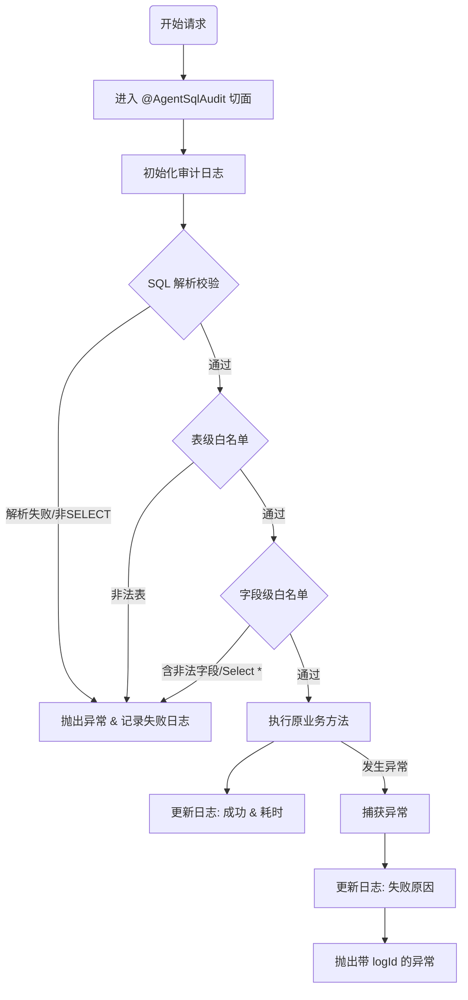

# 核心功能模块：SQL 安全审计与动态白名单切面

## 1. 功能概述
在数据查询服务中，为了防止恶意 SQL 注入、越权访问敏感字段以及记录完整的执行链路，实现了基于 Spring AOP 的拦截器。
该模块主要承担职责：

1.  **全链路审计**：记录 SQL 执行前、执行后的耗时及状态，生成唯一的 `logId` 用于全链路追踪。
2.  **静态安全分析**：在 SQL 执行前，利用 AST（抽象语法树）解析技术对 SQL 进行深度体检。
3.  **双重防线**：实现了“表级”与“字段级”的双层白名单控制。

## 2. 核心流程设计
采用 `@Around` 环绕通知，将安全校验逻辑前置于业务执行之前。



## 3. 技术亮点与实现细节

### 3.1 基于 `JSqlParser` 的 AST 解析

不同于简单的正则匹配（Regex），使用 `JSqlParser` 将 SQL 语句解析为 Java 对象结构（`Statement -> SelectBody -> SelectItems`）。

- **优势**：能够精准识别 SQL 语义，防止通过注释、换行等方式绕过正则检查。

- **实现**：

  ```java
  // 强制限制仅允许查询语句
  Statement statement = CCJSqlParserUtil.parse(sql);
  if (!(statement instanceof Select)) {
      throw new IllegalArgumentException("禁止执行非查询语句");
  }
  ```

### 3.2 双重防御体系 (Defense in Depth)

#### 第一道防线：表级管控

利用 `TablesNamesFinder` 提取 SQL 中涉及的所有表名，校验其是否在 `whitelistManager` 的允许列表中。

- **逻辑**：只要出现一张未授权的表，直接阻断。
- **动态性**：如果有表配置了字段限制，置位 `needColumnCheck = true`，触发更细粒度的检查。

#### 第二道防线：字段级管控

当查询涉及到受限表时，系统会自动降级为“严格模式”，对 `SELECT` 部分进行递归扫描。

- **禁止 `SELECT *`**：在严格模式下，严禁使用通配符，强制用户明确列出字段，避免后续表结构变更导致敏感字段泄露。

- **复杂表达式递归检查**：

  支持对函数嵌套的解析，例如 `COUNT(phone)` 或 `MAX(salary)`。代码通过递归逻辑 `checkExpression` 深入检查函数参数中的字段是否合规。

Java

```java
// 递归检查核心逻辑片段
private void checkExpression(Expression expression, Set<String> allowedColumns) {
    // 1. 基础字段检查
    if (expression instanceof Column) {
        // ... 校验 allowedColumns.contains(colName)
    } 
    // 2. 递归检查函数参数 (如 count(user_id))
    else if (expression instanceof Function) {
        List<Expression> exprs = ((Function) expression).getParameters().getExpressions();
        for (Expression expr : exprs) {
            checkExpression(expr, allowedColumns); // 递归入口
        }
    }
}
```

### 3.3 异常与日志闭环

- **Log ID 透传**：在 `logHandler.initLog(sql)` 生成日志 ID 后，无论执行成功还是失败，都会将该 ID 关联到结果或异常中。
- **异常封装**：自定义 `SqlExecuteException`，携带 `logId` 抛出。前端捕获异常后，可根据 logId 快速定位具体的错误 SQL 和堆栈，极大提高了排查效率。

## 4. 安全策略总结

| **检查项**   | **策略描述**                | **触发条件**   |
| ------------ | --------------------------- | -------------- |
| **SQL 类型** | 仅允许 `SELECT`             | 所有请求       |
| **表权限**   | 表必须在白名单中            | 所有请求       |
| **全表扫描** | 禁止 `SELECT *`             | 当涉及受限表时 |
| **敏感字段** | 字段必须在允许集合中        | 当涉及受限表时 |
| **复杂查询** | 暂时阻断 `UNION` 等复杂语法 | 安全模式下     |

## 5. 待优化项 (TODO)

1. **别名处理**：目前代码对 `AS` 别名的处理依赖` JSqlParser` 的默认行为，未来需增强对 `t.column` 形式的别名溯源能力。
2. **Where 条件审计**：目前主要审计了 `SELECT` 投影列，未来可扩展至 `WHERE` 子句，防止利用未授权字段进行筛选推测数据。

### 功能迭代：Where 条件审计 (Optimization)

**发现问题**：
初步版本的审计仅覆盖了 `SELECT` 投影列。如果用户在 `WHERE` 子句中使用未授权字段进行过滤（例如 `WHERE secret_col = 'xxx'`），虽然不会直接返回该字段的值，但可以通过返回结果的行数推断出数据内容（盲注风险）。

**AST 结构分析**：
SQL 的 `WHERE` 子句在 `JSqlParser` 中是一个复杂的表达式树（Expression Tree）。例如 `age > 18 AND (dept_id = 1 OR dept_id = 2)` 会被解析为嵌套的 `AndExpression`、`OrExpression` 和 `Parenthesis`。

**解决方案**：
升级 `checkExpression` 方法，采用**递归遍历 (Recursive Traversal)** 策略。

1.  **叶子节点处理**：当遇到 `Column` 类型时，执行白名单校验。
2.  **中间节点处理**：
    * **二元运算** (`BinaryExpression`)：递归检查 Left 和 Right 节点。
    * **函数/括号** (`Function`/`Parenthesis`)：取出内部表达式继续递归。
    * **范围查询** (`Between`/`In`)：遍历其包含的所有子表达式。

**修改 `validateSqlSafety` (增加 Where 校验入口)**：

```java
// ... 前面的代码不变
if (needColumnCheck) {
    Select select = (Select) statement;
    SelectBody selectBody = select.getSelectBody();

    if (selectBody instanceof PlainSelect) {
        PlainSelect plainSelect = (PlainSelect) selectBody;
        
        // 1. 校验 SELECT 投影列 (原有的)
        validateSelectItems(plainSelect, globalAllowedColumns);
        
        // 2. 【新增】校验 WHERE 条件列
        validateWhereClause(plainSelect, globalAllowedColumns);
        
    } else {
        throw new IllegalArgumentException("安全模式下暂不支持复杂的联合查询(UNION等)");
    }
}
```

**新增 `validateWhereClause` 方法**

```java
/**
 * 校验 WHERE 子句中的字段
 */
private void validateWhereClause(PlainSelect plainSelect, Set<String> allowedColumns) {
    Expression where = plainSelect.getWhere();
    // 如果没有 where 条件，则无需校验
    if (where == null) {
        return;
    }
    // 复用递归检查逻辑
    checkExpression(where, allowedColumns);
}
```

**重写 `checkExpression` (核心：支持复杂的表达式树)**

```java
private void checkExpression(Expression expression, Set<String> allowedColumns) {
    if (expression == null) return;

    // Case 1: 这是一个字段 (递归的终点)
    if (expression instanceof Column) {
        Column column = (Column) expression;
        String colName = column.getColumnName().replace("`", "").toLowerCase();
        
        if (!allowedColumns.contains(colName)) {
            throw new IllegalArgumentException("非法访问: 字段 [" + colName + "] 未授权或已禁用 (出现在条件中)");
        }
    }
    // Case 2: 这是一个函数，例如 COUNT(user_id)
    else if (expression instanceof Function) {
        Function function = (Function) expression;
        if (function.getParameters() != null) {
            for (Expression expr : function.getParameters().getExpressions()) {
                checkExpression(expr, allowedColumns);
            }
        }
    }
    // Case 3: 二元运算 (AND, OR, =, >, <, LIKE 等)
    // BinaryExpression 是 JSqlParser 中绝大多数运算的父类
    else if (expression instanceof BinaryExpression) {
        BinaryExpression binary = (BinaryExpression) expression;
        checkExpression(binary.getLeftExpression(), allowedColumns);
        checkExpression(binary.getRightExpression(), allowedColumns);
    }
    // Case 4: 括号 (a = 1 AND (b = 2 OR c = 3))
    else if (expression instanceof Parenthesis) {
        Parenthesis parenthesis = (Parenthesis) expression;
        checkExpression(parenthesis.getExpression(), allowedColumns);
    }
    // Case 5: IN 查询 (id IN (1, 2, 3))
    else if (expression instanceof InExpression) {
        InExpression inExpr = (InExpression) expression;
        checkExpression(inExpr.getLeftExpression(), allowedColumns);
        // 如果右边是子查询，暂时不支持或需要更深层递归，这里假设是值列表
        if (inExpr.getRightItemsList() instanceof ExpressionList) {
             ExpressionList list = (ExpressionList) inExpr.getRightItemsList();
             for (Expression expr : list.getExpressions()) {
                 checkExpression(expr, allowedColumns);
             }
        }
    }
    // Case 6: BETWEEN (age BETWEEN 10 AND 20)
    else if (expression instanceof Between) {
        Between between = (Between) expression;
        checkExpression(between.getLeftExpression(), allowedColumns);
        checkExpression(between.getBetweenExpressionStart(), allowedColumns);
        checkExpression(between.getBetweenExpressionEnd(), allowedColumns);
    }
    // 其他不常见的表达式暂时忽略，或者根据需求继续补充
}
```

**优化后效果**：
现在系统能够拦截如下隐蔽攻击：

* ❌ `SELECT vin from t_cickp_bms where status = 1 limit 10;` (当status字段被禁止)