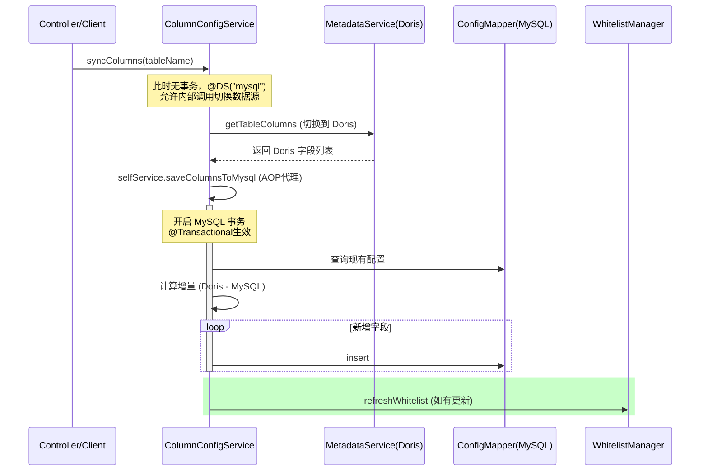

# 实习开发笔记：多数据源环境下的元数据同步功能

## 1. 需求背景
**功能描述**：需要将 OLAP 引擎（Doris）中的表结构元数据（字段名、类型等），同步到业务数据库（MySQL）的配置表中，用于后续的字段级权限控制和白名单管理。
**技术难点**：涉及跨数据源操作（Doris 读取 + MySQL 写入），以及 Spring 事务与动态数据源注解的兼容性处理。

## 2. 核心逻辑流程
该功能主要分为两步：先从 Doris 获取最新元数据，对比本地 MySQL 配置，对新增字段进行增量插入，最后刷新缓存。



## 3. 关键代码实现

```java
@Slf4j
@Service
@DS("mysql") // 默认主库
public class ColumnConfigServiceImpl implements ColumnConfigService {

    @Resource
    private DatabaseMetadataService metadataService;
    @Resource
    private ColumnConfigMapper columnMapper;
    @Resource
    private SqlWhitelistManager whitelistManager;

    /**
     * 关键点：注入自己
     * 必须加 @Lazy 防止构造器循环依赖报错
     * 用于解决类内部调用导致 @Transactional 失效的问题
     */
    @Lazy
    @Resource
    private ColumnConfigService selfService;

    /**
     * 第一阶段：跨库查询（无事务）
     * 目的：为了让 metadataService 能成功识别并切换到 Doris 数据源
     */
    public void syncColumns(String tableName) {
        // Step 1: 查 Doris (利用多数据源框架特性，此时不能有 MySQL 事务上下文)
        List<Map<String, Object>> dbColumns = metadataService.getTableColumns(tableName);

        if (dbColumns.isEmpty()) {
            throw new RuntimeException("Doris中不存在表 [" + tableName + "]");
        }

        // Step 2: 写 MySQL (通过代理对象调用，触发事务)
        selfService.saveColumnsToMysql(tableName , dbColumns);
    }

    /**
     * 第二阶段：本地落库（开启事务）
     */
    @Transactional(rollbackFor = Exception.class)
    public void saveColumnsToMysql(String tableName , List<Map<String, Object>> dbColumns) {
        // 1. 查当前配置表
        List<ColumnConfig> existList = columnMapper.selectList(
                new LambdaQueryWrapper<ColumnConfig>().eq(ColumnConfig::getTableName, tableName)
        );
        Set<String> existSet = existList.stream()
                .map(ColumnConfig::getColumnName)
                .collect(Collectors.toSet());

        // 2. 增量插入逻辑
        int addCount = 0;
        for (Map<String, Object> col : dbColumns) {
            String colName = (String) col.get("COLUMN_NAME");
            // 仅插入不存在的字段
            if (!existSet.contains(colName)) {
                ColumnConfig config = new ColumnConfig();
                config.setTableName(tableName);
                config.setColumnName(colName);
                config.setColumnType((String) col.get("DATA_TYPE"));
                config.setComment((String) col.get("COLUMN_COMMENT"));
                config.setStatus(1); 
                columnMapper.insert(config);
                addCount++;
            }
        }

        // 3. 只有数据变动才刷新缓存
        if (addCount > 0) {
            whitelistManager.refreshWhitelist();
        }
    }
    
    // ... 其他 CRUD 方法
}
```

## 4. 技术亮点与坑点总结 (Review 重点)

### 4.1 解决类内部调用 AOP 失效问题

- **问题**：在 `syncColumns` 方法中直接调用 `this.saveColumnsToMysql()`，Spring 的 AOP 代理无法拦截该调用，导致 `saveColumnsToMysql` 上标注的 `@Transactional` 注解失效，发生异常时无法回滚。
- **解决方案**：
  1. **Self-Injection**：通过 `@Resource` 注入 `ColumnConfigService selfService`（即当前类自身的代理对象）。
  2. **@Lazy**：必须加上 `@Lazy` 注解，否则 Spring 容器在初始化 Bean 时会陷入“自己等待自己创建完成”的死循环（Circular Dependency）。
  3. **调用方式**：使用 `selfService.saveColumnsToMysql(...)` 显式走代理调用。

### 4.2 动态数据源与事务的边界控制

- **设计考量**：
  - 如果在 `syncColumns` 方法上直接加 `@Transactional`，Spring 会在方法开始时就获取默认数据源（MySQL）的连接并开启事务。
  - 后续调用 `metadataService.getTableColumns` 时，即使该 Service 标记了 `@DS("doris")`，由于外部已经绑定了 MySQL 的 Connection，可能会导致切换数据源失败，或者在 Doris 操作上错误地挂载了 MySQL 的事务上下文。
- **最佳实践**：将“读异构数据源”和“写本地数据源”分开。`syncColumns` 作为编排层不加事务，只负责调度；写操作单独封装在 `saveColumnsToMysql` 中并开启事务。

### 4.3 待优化点 (TODO)

- **批量插入性能**：目前的实现是在 `for` 循环中逐条调用 `columnMapper.insert`。如果一次性同步的字段过多（如 50+），会产生多次数据库网络 IO。
- **优化方案**：后续可改为 `MyBatis-Plus` 的 `saveBatch` 或 XML 中的 `foreach` 批量插入，将时间复杂度从 N 次 IO 降为 1 次 IO。

#### 优化后的核心方法

```java
@Transactional(rollbackFor = Exception.class)
public void saveColumnsToMysql(String tableName, List<Map<String, Object>> dbColumns) {
    // 1. 查当前配置表（避免重复插入）
    List<ColumnConfig> existList = columnMapper.selectList(
            new LambdaQueryWrapper<ColumnConfig>().eq(ColumnConfig::getTableName, tableName)
    );
    Set<String> existSet = existList.stream()
            .map(ColumnConfig::getColumnName)
            .collect(Collectors.toSet());

    // 2. 内存组装数据（不进行数据库交互）
    List<ColumnConfig> batchInsertList = new ArrayList<>();
    
    for (Map<String, Object> col : dbColumns) {
        String colName = (String) col.get("COLUMN_NAME");

        // 过滤已存在的字段
        if (!existSet.contains(colName)) {
            ColumnConfig config = new ColumnConfig();
            config.setTableName(tableName);
            config.setColumnName(colName);
            config.setColumnType((String) col.get("DATA_TYPE"));
            config.setComment((String) col.get("COLUMN_COMMENT"));
            config.setStatus(1); // 默认新字段启用
            
            // 【优化点】：只添加到集合，不立即调用 mapper
            batchInsertList.add(config);
        }
    }

    // 3. 批量插入（一次网络 IO）
    if (!batchInsertList.isEmpty()) {
        // saveBatch 是 ServiceImpl 提供的能力，默认批次大小为 1000
        this.saveBatch(batchInsertList);
        log.info("表[{}] 增量同步字段 {} 个", tableName, batchInsertList.size());
        
        // 4. 刷新缓存
        whitelistManager.refreshWhitelist();
    }
}
```

#### 性能优化记录

**优化前问题**： 原逻辑在 `for` 循环中逐条调用 `columnMapper.insert()`。

- **现象**：如果有 50 个新字段，会建立 50 次数据库连接（或从连接池借出 50 次），产生 50 次网络 RTT（往返时延）。
- **风险**：在数据量较大时，会导致同步接口响应缓慢，且占用大量数据库连接资源。

**优化后方案**：

##### ColumnConfigMapper.java

```java
// 添加接口
int insertBatch(@Param("list") List<ColumnConfig> list);
```

##### ColumnConfigMapper.xml

```xm
<insert id="insertBatch">
    INSERT INTO column_config (table_name, column_name, column_type, comment, status)
    VALUES
    <foreach collection="list" item="item" separator=",">
        (#{item.tableName}, #{item.columnName}, #{item.columnType}, #{item.comment}, #{item.status})
    </foreach>
</insert>
```

- **手段**：使用 MyBatis 的 `insertBatch` 方法。
- **效果**：将 N 次数据库交互合并为 1 次（或少量几次，取决于 batchSize）。
