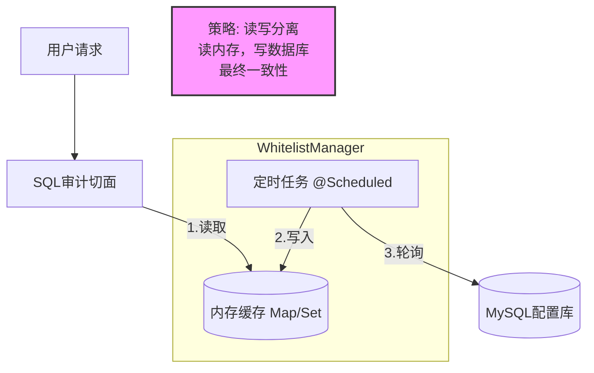

# 核心组件：高性能白名单缓存管理器 (WhitelistManager)

## 1. 设计目标
SQL 审计拦截器 (`AgentSqlAuditAspect`) 需要在极短的时间内（毫秒级）判断一张表或一个字段是否允许访问。
为了避免每次校验都发生数据库 I/O，设计了基于 **JVM 内存缓存 + 定时刷新** 的管理机制。

**架构图解**：




## 2. 核心实现分析

### 2.1 双层缓存结构

使用 Java 原生集合存储，无需引入 Redis，进一步降低链路延迟。

- `Set<String> allowedTables`: **O(1) 复杂度** 快速判断表名是否存在。
- `Map<String, Set<String>> allowedColumnsMap`: 通过表名 O(1) 定位到该表允许的字段集合。

### 2.2 "Copy-On-Write" 思想实现的读写并发安全

这是一个非常经典的**高并发读写处理技巧**。

**代码细节**：

```java
// 1. 加载表白名单 (只查 Active=1)
Set<String> newTables = whitelistMapper.selectList(
        new LambdaQueryWrapper<TableWhitelist>().eq(TableWhitelist::getIsActive, 1)
).stream().map(t -> t.getTableName().toLowerCase()).collect(Collectors.toSet());

// ... 填充数据 ...

// 关键点：原子性引用替换
this.allowedTables = newTables;
```

**原理解析**：

1. **构造阶段**：在 `refreshWhitelist` 内部构建 `newTables` 和 `newColMap` 时，完全不影响正在对外提供服务的 `allowedTables`（旧引用）。
2. **切换阶段**：Java 中的引用赋值（Reference Assignment）是原子操作。
3. **效果**：读取线程要么读到旧缓存，要么读到新缓存，永远不会读到“写了一半”的脏数据，且读取过程**无需加锁**，性能极高。

### 2.3 数据规范化 (Normalization)

- **代码**：`.toLowerCase()`
- **作用**：SQL 语法不区分大小写（`SELECT ID` 和 `select id` 是一样的）。在存入缓存和读取缓存时统一转为小写，确保了校验的准确性，防止因大小写差异导致的白名单失效。

### 2.4 刷新机制 (Refresh Policy)

采用了 **主动推送 + 被动轮询** 结合的策略：

1. **被动轮询**：`@Scheduled(fixedDelay = 60000)` 兜底。即使没有任何操作，每分钟也会同步一次数据库状态，保证数据最终一致性。
2. **主动推送**：(在之前的 `ColumnConfigServiceImpl` 中) 当管理员在后台修改配置后，手动调用 `refreshWhitelist()`，实现配置的**秒级生效**。

## 3. 代码亮点总结 

| **关注点**   | **实现方案**                       | **优势**                                               |
| ------------ | ---------------------------------- | ------------------------------------------------------ |
| **高性能**   | 本地内存缓存 (`HashMap`/`HashSet`) | 避免了数据库 I/O，校验耗时 < 0.1ms                     |
| **线程安全** | 引用替换 (Reference Swap)          | 读取操作无锁 (Lock-free)，并发性能高                   |
| **健壮性**   | `try-catch` 包裹刷新逻辑           | 即使数据库挂了，缓存依然保留上一份可用快照，不影响业务 |
| **灵活性**   | `@Scheduled` + 手动调用            | 兼顾了自动化同步与实时性要求                           |

## 4. 潜在优化点 (TODO)

### 4.1 内存保护

- **现状**：目前假设配置表数据量不大。
- **风险**：如果系统有 10 万张表，每张表 100 个字段，`allowedColumnsMap` 可能会占用较大堆内存。
- **优化**：如果配置量级达到百万级，建议引入 Guava Cache 或 Caffeine，设置最大容量 `maximumSize` 和驱逐策略。

### 4.2 增量更新

- **现状**：每次 `refreshWhitelist` 都是全量查询数据库 (`selectList`)。
- **优化**：如果配置数据非常庞大，可以加一个 `update_time` 字段，每次只查最近 1 分钟变更的数据进行合并。但对于一般的后台系统，全量刷新的开销（几千条数据）完全可以忽略不计，**简单即是美**。


### 💡 笔记小贴士

1.  **面试加分项**：
    如果面试官问：“你的缓存为什么不用 `ConcurrentHashMap`？”
    **回答**：因为我的刷新逻辑是**全量替换**。我在方法内部造好了一个全新的 `HashMap`，然后把引用指过去。对于读线程来说，它拿到的永远是一个只读的、完整的 Map。`ConcurrentHashMap` 是为了解决“边读边写”的线程安全问题，而我这里通过“引用切换”避开了“边读边写”，所以用普通的 `HashMap` 配合 `volatile` 语义（Spring Bean 的可见性通常由容器保证，或者加 `volatile`）就足够了，且性能更好。

2.  **大小写问题**：
    一定要强调 `toLowerCase()`。这是新手容易忽略的细节。如果不转小写，黑客写个 `Select Password from User` 可能就绕过你的 `password` 白名单了。